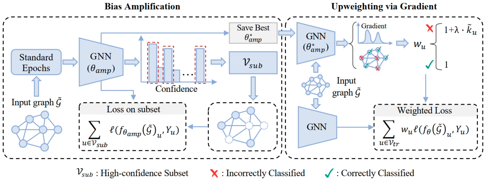

# FairSAD
A PyTorch implementation of "Grad2Fair: A Gradient-driven Approach for Graph Fairness without Demographics"

## 📖 Overview

Graph Neural Networks (GNNs) often suffer from fairness problems. Existing fairness methods require true or predicted demographic data, which are frequently unavailable or inaccurate.

We tackle graph fairness **without demographic data** based on a key observation: *gradient distributions of misclassified nodes implicitly encode demographic information*.

This repository introduces two main contributions:

* 📊 **GradDist:** A gradient-based metric that quantifies bias by measuring the distance between local modes in gradient distributions.
* 🛠️ **Grad2Fair:** A gradient-guided approach that directly leverages these gradients to debias GNNs, completely eliminating the need for demographic labels or predictions.

<div align="center">
  
  <p><em>Overview of Grad2Fair</em></p>
</div>

## Requirements
- numpy==1.21.5
- torch==1.13.1
- torch-cluster==1.5.9
- torch_geometric==1.7.2
- torch-scatter==2.1.1
- torch-sparse==0.6.17
- CUDA 12.4

## Examples of GradDist
An example of GradDist evaluating synthetic data:
```python
import numpy as np
from graddist import GradDist

np.random.seed(42) # Fix the random seed for reproducibility
data1 = np.random.normal(loc=10, scale=2, size=1000)
data2 = np.random.normal(loc=20, scale=1.5, size=500)
data3 = np.random.normal(loc=5, scale=0.5, size=50) 
data = np.concatenate([data1, data2, data3])

grad_dist = GradDist()
normalized_distance = grad_dist.compute(data)
print(f"Normalized Distance: {normalized_distance}")
```

## Reproduction
To reproduce Grad2Fair, please run:
```shell
bash run_grad2fair.sh
```

To reproduce Fairwos or FDKD, please run:
```shell
bash run_baselines.sh
```

## Citation
If you find it useful, please cite our paper. Thank you!
